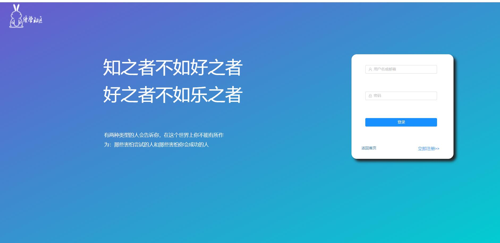
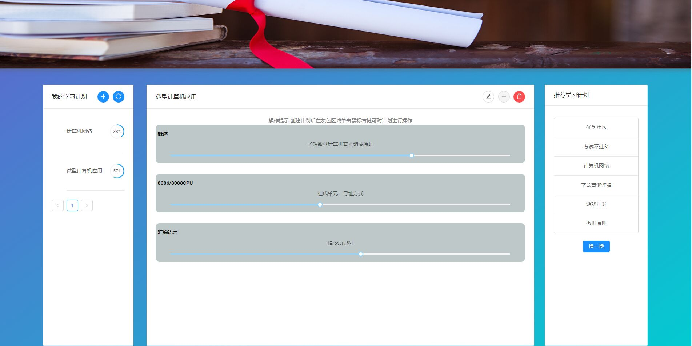
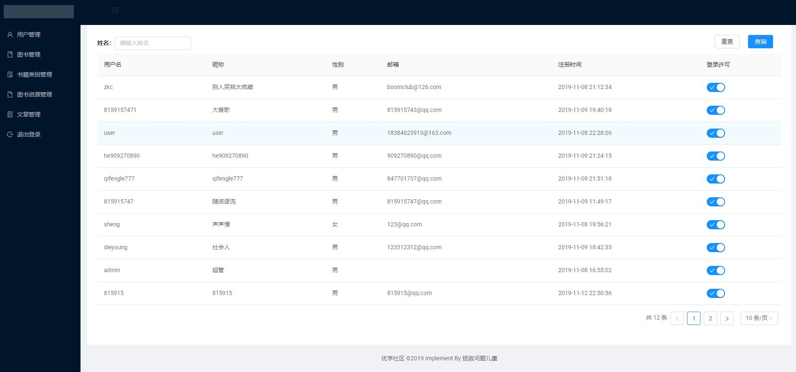

# Important

Issues of this repository are tracked on https://github.com/aspnetboilerplate/aspnetboilerplate. Please create your issues on https://github.com/aspnetboilerplate/aspnetboilerplate/issues.

# Introduction

This is a template to create **ASP.NET Core MVC / Angular** based startup projects for [ASP.NET Boilerplate](https://aspnetboilerplate.com/Pages/Documents). It has 2 different versions:

1. [ASP.NET Core MVC & jQuery](https://aspnetboilerplate.com/Pages/Documents/Zero/Startup-Template-Core) (server rendered multi-page application).
2. [ASP.NET Core & Angular](https://aspnetboilerplate.com/Pages/Documents/Zero/Startup-Template-Angular) (single page application).
 
User Interface is based on [BSB Admin theme](https://github.com/gurayyarar/AdminBSBMaterialDesign).
 
# Download

Create & download your project from https://aspnetboilerplate.com/Templates

# Screenshots

#### 登录界面

#### 首页

#### 图书资源

#### 学习计划

#### 社区

#### 个人信息

#### 管理系统界面

# License

[MIT](LICENSE).
